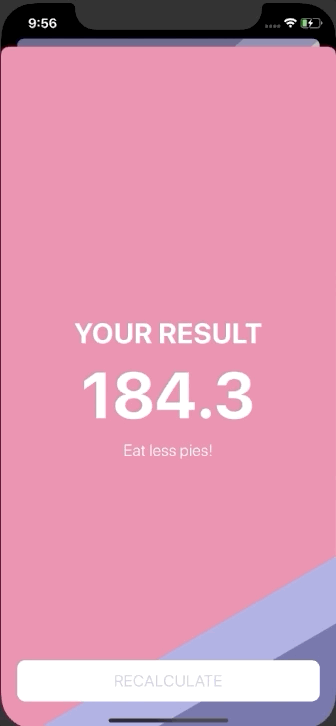

#  BMI Calculator

## About:-

This App was created to calculate BMI of the user and show custom messages based on thier BMIs and also change the background color of the screen. The weight and height are selected using the UIslider and the values are fed to the view controller and the data is being passed on the next screen via segues.

> courtesy appbrewery for the course and skeleton projects.

